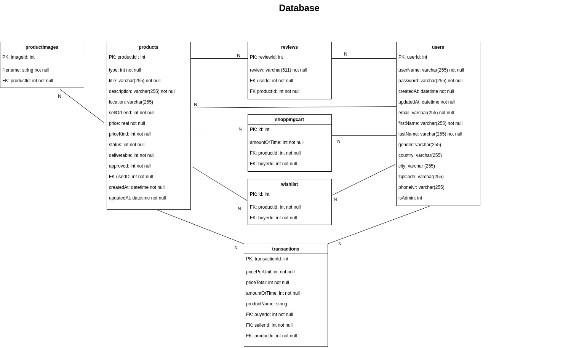

# ESE2020 Team 5 Backend

## Prerequisite
You should have installed [NodeJS and npm](https://nodejs.org/en/download/) (they come as one) in order to start the backend server.

## Start
- clone the ese2020-team5 repository
- navigate to the backend folder `cd ese2020-team5/backend`
- run `npm install`
- run `npm run dev`
- open your browser with the url [http://localhost:3000](http://localhost:3000/)

## About

1. The logic is split up:
	- authorizing a request is done via middleware
	- logic e.g. creating/authentication is done via [UserService](./src/services/user.service.ts)
2. The controller itself is structured as a class.

## Tests

Run the postman backend test the following way:

```
npm install newman
npm run dev &
newman run Integration\ Tests.postman_collection.json -e admin.postman_environment.json
newman run Integration\ Tests.postman_collection.json -e User.postman_environment.json
```

or you can import the `Integration\ Tests.posman_collection.json` and the two environment files to postman and run it with the GUI.

## Database Diagram



## Endpoints
Some endpoints can be called in a [browser](http://localhost:3000), others have to be called by a REST Client. [Here](./postman_collection) you can find a collection that contains all requests, which you can import into Postman. [Postman](https://www.postman.com/) is a REST Client.

Here are some examples of the endpoints, please refer to the postman collection to see all kind of requests.

### `/products`
- POST

	<details>
		<summary>Request</summary>

	```json
	{
     "title": "string",
     "type": "number",
     "description": "string",
     "location": "string",
     "sellOrLend": "number",
     "price": "number",
     "priceKind": "number",
     "status": "number",
     "deliverable": "number",
     "approved": "number",
     "userId": "number"
	}
	```

	</details>

	<details>
		<summary>Response</summary>

		Code: 200
		Body:

	```json
	{
    "productId": "number",
    "title": "string",
    "type": "number",
    "description": "string",
    "location": "string",
    "sellOrLend": "number",
    "price": "number",
    "priceKind": "number",
    "amount": "number",
    "status": "number",
    "deliverable": "number",
    "approved": "number",
    "userId": "number"
	}
	```
</details>

- POST `/:id/image/`

	<details>
		<summary>Request</summary>

	```json
	{
    "filename": "string"
	}
	```
	</details>

	<details>
		<summary>Response</summary>

		Code: 200
		Body:

	```json
	{
    "imageId": "number",
    "filename": "string",
    "productId": "number"
	}
	```
</details>

- PUT `/:id`

	<details>
		<summary>Request</summary>

	```json
	{
      "title": "string",
      "type": "number",
      "description": "string",
      "location": "string",
      "sellOrLend": "number",
      "price": "number",
      "priceKind": "number",
      "status": "number",
      "deliverable": "number",
      "approved": "number",
      "userId": "number"
	}
	```
	</details>

	<details>
		<summary>Response</summary>

		Code: 200
		Body:

	```json
	{
    "productId": "number",
    "title": "string",
    "type": "number",
    "description": "string",
    "location": "string",
    "sellOrLend": "number",
    "price": "number",
    "priceKind": "number",
    "amount": "number",
    "status": "number",
    "deliverable": "number",
    "approved": "number",
    "userId": "number"
	}
	```
</details>

- DELETE `/:id`<br/>
    <details>
    <summary>Response</summary>
    
    	Code: 200
    	Body:
    	
    ```json
    {
      "productId": "number",
      "title": "string",
      "type": "number",
      "description": "string",
      "location": "string",
      "sellOrLend": "number",
      "price": "number",
      "priceKind": "number",
      "amount": "number",
      "status": "number",
      "deliverable": "number",
      "approved": "number",
      "userId": "number"
    }
     ```
    </details>
    
- DELETE `/image/:id`<br/>
    <details>
    <summary>Response</summary>
    
    	Code: 200
    	Body:
    	
    ```json
    {
      "imageId": "number",
      "filename": "string",
      "productId": "number"
   }
    ```
  </details>
    	
    	

- GET
	<details>
		<summary>Response</summary>

		Code: 200
		Body:
	```json
    [
	     {
	             "productId": "number",
              "title": "string",
              "type": "number",
              "description": "string",
              "location": "string",
              "sellOrLend": "number",
              "price": "number",
              "priceKind": "number",
              "amount": "number",
              "status": "number",
              "deliverable": "number",
              "approved": "number",
              "userId": "number",
              "reviews": "Review[]",
              "images" : "Image[]" 
	     },
         ...
    ]
	```
	</details>

- GET `/catalog`
	<details>
		<summary>Response</summary>

		Code: 200
		Body:
	```json
    [
	     {
	             "productId": "number",
              "title": "string",
              "type": "number",
              "description": "string",
              "location": "string",
              "sellOrLend": "number",
              "price": "number",
              "priceKind": "number",
              "amount": "number",
              "status": "number",
              "deliverable": "number",
              "approved": "number",
              "userId": "number",
              "reviews": "Review[]",
              "images" : "Image[]" 
	     },
         ...
    ]
	```
	</details>

- GET `/admin-catalog`
	<details>
		<summary>Response</summary>

		Code: 200
		Body:
	```json
    [
	     {
              "productId": "number",
              "title": "string",
              "type": "number",
              "description": "string",
              "location": "string",
              "sellOrLend": "number",
              "price": "number",
              "priceKind": "number",
              "amount": "number",
              "status": "number",
              "deliverable": "number",
              "approved": "number",
              "userId": "number",
              "reviews": "Review[]",
              "images" : "Image[]" 
	     },
         ...
    ]
	```
	</details>

- GET `/:id`
	<details>
		<summary>Response</summary>

		Code: 200
		Body:
	```json
	{
    "productId": "number",
    "title": "string",
    "type": "number",
    "description": "string",
    "location": "string",
    "sellOrLend": "number",
    "price": "number",
    "priceKind": "number",
    "amount": "number",
    "status": "number",
    "deliverable": "number",
    "approved": "number",
    "userId": "number",
    "reviews": "Review[]",
    "images" : "Image[]" 
	} 
	```
	</details>

### `/review`
- POST
	<details>
		<summary>Request</summary>

		Code: 200
		Body:
	```json
	{
    "review": "string",
    "rating": "number",
    "productId": "number"
	}

	```
	</details>

	<details>
		<summary>Response</summary>

		Code: 200
		Body:
	```json
	{
    "reviewId": "number",
    "review": "string",
    "rating": "number",
    "productId": "number",
    "userId": "number"
	}

	```
	</details>

- PUT `/:id`
	<details>
		<summary>Request</summary>

		Code: 200
		Body:
	```json
	{
    "review": "string",
    "rating": "number"
	}

	```
	</details>
	<details>
		<summary>Response</summary>

		Code: 200
		Body:
	```json
	{
    "reviewId": "number",
    "review": "string",
    "rating": "number",
    "productId": "number",
    "userId": "number"
	}

	```
	</details>

- DELETE `/:id`<br>
    <details>
        <summary>Response</summary>
        
	    Code: 200
	    Body:
	```json
	{
    "reviewId": "number",
    "review": "string",
    "rating": "number",
    "productId": "number",
    "userId": "number"
	}

	```
	</details>

### `/user`
- POST `/register`
	<details>
		<summary>Request</summary>

		Code: 200
		Body:
	```json
	{
    "userName": "string",
    "password": "string",
    "email":"string",
    "lastName":"string",
    "firstName":"string",
    "gender": "string",
    "country": "string",
    "city": "string",
    "street": "string",
    "zipCode": "string",
    "phoneNr": "string",
    "isAdmin": "number"
	}

	```
	</details>
	<details>
		<summary>Response</summary>

		Code: 200
		Body:
	```json
	{
    "userId": "number",
    "userName": "string",
    "password": "string (hashed)",
    "email": "string",
    "lastName": "string",
    "firstName": "string",
    "gender": "string",
    "country": "string",
    "city": "string",
    "street": "string",
    "zipCode": "string",
    "phoneNr": "string",
    "credits": "number",
    "isAdmin": "number"
	}

	```
	</details>

- POST `/login`
	<details>
		<summary>Request</summary>

		Code: 200
		Body:
	```json
	{
    "userNameOrEmail": "string",
    "password": "string"
	}

	```
	</details>
	<details>
		<summary>Response</summary>

		Code: 200 || 403
		Body:
	```json
	{
	"user": {
        "userId": "number",
        "userName": "string",
        "password": "string (hashed)",
        "email": "string",
        "lastName": "string",
        "firstName": "string",
        "gender": "string",
        "country": "string",
        "city": "string",
        "street": "string",
        "zipCode": "string",
        "phoneNr": "string",
        "credits": "number",
        "isAdmin": "number"
	},
	"token": "string"
	}

	```
	</details>

- GET `/purchased`
	<details>
		<summary>Response</summary>

		Code: 200
		Body:
	```json
	[
    {
      "productId": "number",
      "title": "string",
      "type": "number",
      "description": "string",
      "location": "string",
      "sellOrLend": "number",
      "price": "number",
      "priceKind": "number",
      "amount": "number",
      "status": "number",
      "deliverable": "number",
      "approved": "number",
      "userId": "number",
      "reviews": "Review[]",
      "images" : "Image[]" 
     },
    ...
    ]
	```
	</details>

- GET `/:id/public`
	<details>
		<summary>Response</summary>

		Code: 200
		Body:
	```json
	{
    "userId": "number",
    "userName": "string",
    "isAdmin": "number"
	}
	```
	</details>

- GET `/:id/products`
	<details>
		<summary>Response</summary>

		Code: 200
		Body:
	```json
	[
    {
      "productId": "number",
      "title": "string",
      "type": "number",
      "description": "string",
      "location": "string",
      "sellOrLend": "number",
      "price": "number",
      "priceKind": "number",
      "amount": "number",
      "status": "number",
      "deliverable": "number",
      "approved": "number",
      "userId": "number",
      "reviews": "Review[]",
      "images" : "Image[]" 
    },
    ...
  ]
	```
	</details>

- GET `/all`
	<details>
		<summary>Response</summary>

		Code: 200
		Body:
	```json
	[
	  {
     "userId": "number",
     "userName": "string",
     "password": "string (hashed)",
     "email":"string",
     "lastName":"string",
     "firstName":"string",
     "gender": "string",
     "country": "string",
     "city": "string",
     "street": "string",
     "zipCode": "string",
     "phoneNr": "string",
     "credits": "number",
     "isAdmin": "number"
   },
   ...
	]

	```
	</details>

- GET `/`
	<details>
		<summary>Response</summary>

		Code: 200
		Body:
	```json
	{
    "userId": "number",
    "userName": "string",
    "password": "string (hashed)",
    "email":"string",
    "lastName":"string",
    "firstName":"string",
    "gender": "string",
    "country": "string",
    "city": "string",
    "street": "string",
    "zipCode": "string",
    "phoneNr": "string",
    "credits": "number",
    "isAdmin": "number"
	}
	```
	</details>

- DELETE `/:id`
    <deatails>
        <summary>Response</summary>
        
        Code: 200
        Body:
     ```json
     {
        "userId": "number",
         "userName": "string",
         "password": "string (hashed)",
         "email":"string",
         "lastName":"string",
         "firstName":"string",
         "gender": "string",
         "country": "string",
         "city": "string",
         "street": "string",
         "zipCode": "string",
         "phoneNr": "string",
         "credits": "number",
         "isAdmin": "number"
     }
     ```
    </details>

- GET `/reviews`
    <details>
        <summary>Response</summary>
        
        Code: 200
        Body:
    ```json
    [
      {
        "reviewId": "number",
        "review": "string",
        "rating": "number",
        "productId": "number",
        "userId": "number"
      },
    ...
    ] 
    ```
    </details>

- PUT `/update`
	<details>
		<summary>Request</summary>

		Code: 200
		Body:
	```json
	{
    "userName": "string",
    "password": "string",
    "email": "string",
    "lastName": "string",
    "firstName": "string",
    "gender": "string",
    "country": "string",
    "city": "string",
    "street": "string",
    "zipCode": "string",
    "phoneNr": "string",
    "isAdmin": "number"
	}

	```
	</details>
	<details>
		<summary>Response</summary>

		Code: 200
		Body:
	```json
	{
	"userId": "number",
	"userName": "string",
    "password": "string (hashed)",
    "email": "string",
    "lastName": "string",
    "firstName": "string",
    "gender": "string",
    "country": "string",
    "city": "string",
    "street": "string",
    "zipCode": "string",
    "phoneNr": "string",
    "credits": "number",
    "isAdmin": "number"
	}

	```
	</details>


### `/notification`

- GET
	<details>
		<summary>Response</summary>

		Code: 200
		Body:
	```json
    [
       {
           "notificationId" : "number",
           "userId" : "number",
           "text" : "string",
           "read" : "number"
       },
       ...
    ]
	```
	</details>


- PUT `/:id`
	<details>
		<summary>Request</summary>

		Code: 200
		Body:
	```json
	{
    "read": "number"
	}

	```
	</details>
	<details>
		<summary>Response</summary>

		Code: 200
		Body:
	```json
	{
    "notificationId" : "number",
    "userId" : "number",
    "text" : "string",
    "read" : "number"
	}

	```
	</details>

- DELETE `/:id`<br>
    <details>
        <summary>Response</summary>
        
	    Code: 200
	    Body:
	```json
	{
    "notificationId": "number",
    "userId"  "number",
    "text": "string",
    "read": "number"
	}

	```
	</details>

### `/cart`
- GET
	<details>
		<summary>Response</summary>

		Code: 200
		Body:
	```json
    [
       {
           "id" : "number",
           "buyerId" : "number",
           "productId" : "number",
           "amountOrTime" : "number"
       },
       ...
    ]
	```
	</details>

- POST `/buy`
    <details>
    	<summary>Request</summary>
    
    	Code: 200
    	Body:
    ```json
    {
        "country": "string",
        "city": "string",
        "street": "string",
        "zipCode": "string"
    }
    
    ```
    </details>
    
	<details>
		<summary>Response</summary>

		Code: 200
		Body:
	```
	OK
	```
	</details>

- POST `/:id`
	<details>
		<summary>Request</summary>

		Code: 200
		Body:
	```json
	{
    "amountOrTime": "number"
	}

	```
	</details>
	<details>
		<summary>Response</summary>

		Code: 200
		Body:
	```json
	{
    "id": "number",
    "buyerId": "number",
    "productId": "number",
    "amountOrTime": "number"
	}

	```
	</details>

- PUT `/:id`
	<details>
		<summary>Request</summary>

		Code: 200
		Body:
	```json
	{
    "amountOrTime": "number"
	}

	```
	</details>
	<details>
		<summary>Response</summary>

		Code: 200
		Body:
	```json
	{
    "id": "number",
    "buyerId": "number",
    "productId": "number",
    "amountOrTime": "number"
	}

	```
	</details>

- DELETE `/:id`<br>
    <details>
        <summary>Response</summary>
        
	    Code: 200
	    Body:
	```json
	{
    "id": "number",
    "buyerId": "number",
    "productId": "number",
    "amountOrTime": "number"
	}

	```
	</details>

### `/wishlist`
- GET
	<details>
		<summary>Response</summary>

		Code: 200
		Body:
	```json
    [
       {
           "id": "number",
           "buyerId": "number",
           "productId": "number"
       },
       ...
    ]
	```
	</details>

- POST `/:id`
	<details>
		<summary>Request</summary>

		Code: 200
		Body:
	```json
	{
    "amountOrTime": "number"
	}

	```
	</details>
	<details>
		<summary>Response</summary>

		Code: 200
		Body:
	```json
	{
    "id": "number",
    "buyerId": "number",
    "productId": "number"
	}

	```
	</details>

- DELETE `/:id`<br>
    <details>
        <summary>Response</summary>
        
	    Code: 200
	    Body:
	```json
	{
    "id": "number",
    "buyerId": "number",
    "productId": "number"
	}

	```
	</details>
